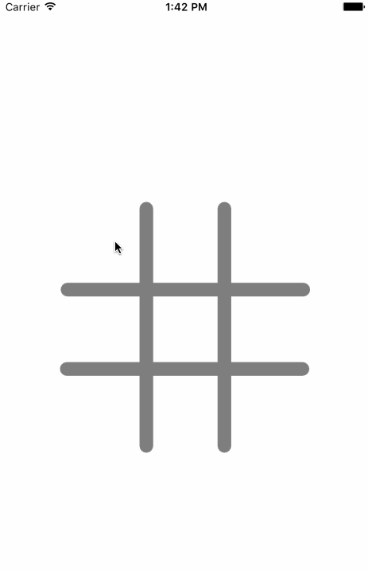

# Tic Tac Toe

_TicTacToe_ is the basic game of tic tac toe, where either the Os or Xs win if they have 3 consecutive Os or Xs on the board.

**Challenges:*** Figuring out the algorithm to check the winning combinations_ Indexes - Figuring out why the index was out of range_ Why I couldn't cast the UIView as a UI Button that I created as a temporary variable

**Learned:*** Buttons can have the same method, just `ctrl` + `drag` that button to the method* UI Elements have tags, which can be useful in certain scenarios to reset the image
