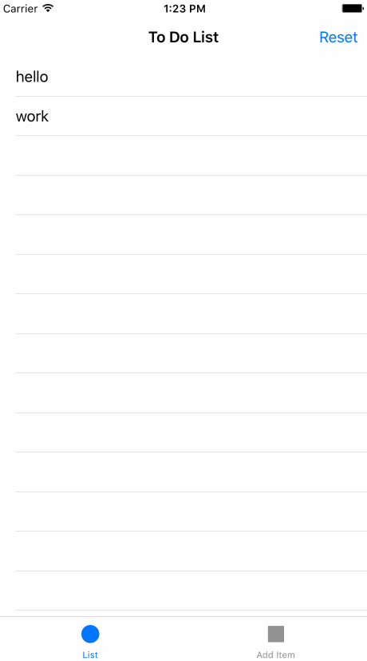

# ToDoList

_toDoList_ keeps a list of items to add to the To Do List.



_Extras:** Added reset button_ Changed text at the bottom* Made sure not to accept empty items

_Learned:*_ Delete action for tables:

```swift
func tableView(tableView: UITableView, commitEditingStyle editingStyle: UITableViewCellEditingStyle, forRowAtIndexPath indexPath: NSIndexPath) {

        if editingStyle == UITableViewCellEditingStyle.Delete {
            toDoList.removeAtIndex(indexPath.row)
            NSUserDefaults.standardUserDefaults().setObject(toDoList, forKey: "toDoList")
        }
        toDoTable.reloadData()
    }
```

- Always check NSUserDefaults to see if it's empty and update whenever your data changes.
