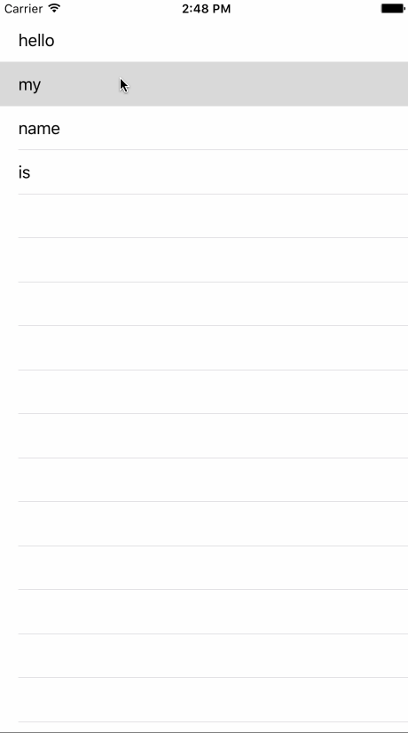

tableView
=========

**tableView** shows a table view with some text in each table cell. It's not very complicated, but it's a simple implementation of a table.

**Future Improvements**

1.	Have a way for users to enter some text and show each letter on a separate line.
2.	Limit the number of rows to the number of letters in the text.
3.	Add new rows for the table.
