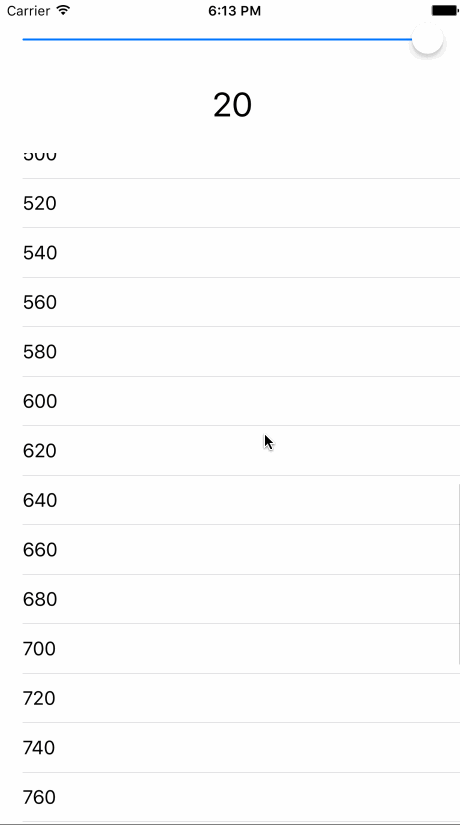

# timesTable

**timesTable** shows a scroller that can be adjusted from 1 to 20 and underneath it, there's a table that shows the value from the scroller multiplied from 1 to 50, on each line.

Learned about:   **UISlider**

- need to ctrl+drag it to the View Controller twice, one to set it as an action and another one to set it as outlet.
- set the minimum and maximum value in storyboard
- find the value that it is currently set on by UISliderName.value

**Tables**

- need to add table.reloadData(). If it's not in some function after an action is performed, you can add this in your viewController.swift file:
- override func viewDidAppear(animated: Bool) { table.reloadData() }
- when creating a prototype cell, remember to add the reuse Identifier in the main.storyboard view. I usually just call it "Cell".
- If you add everything correctly and no data shows in the table, check whether you've dragged dataSource and delegate Referencing outlets to the View Controller in main.storyboards.
