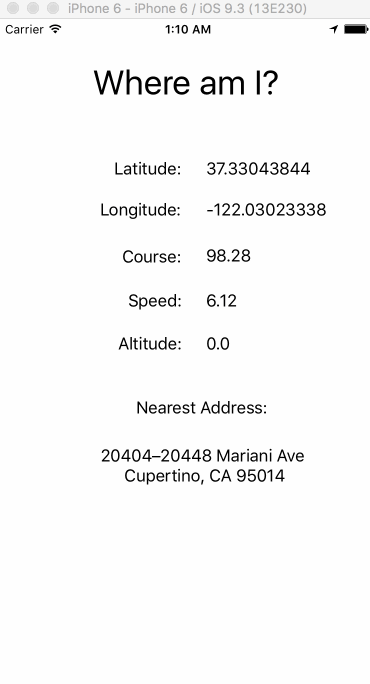

Where Am I
=========

**whereami** shows the latitude, longitude, course, spped, altitude, and nearest address.

**What I Learned**
* Unwrapping optionals. One of the bugs that was super obvious was that there were pesky "Optional("")" text that showed up in the label's text. The way to fix it in the code was to force unwrap it by using a "!". It is explained more [here](https://developer.apple.com/library/ios/documentation/Swift/Conceptual/Swift_Programming_Language/OptionalChaining.html).
* reverseGeocodeLocation - returns the closest location by using the CLPlacemark. [CLGeocoder](https://developer.apple.com/library/ios/documentation/CoreLocation/Reference/CLGeocoder_class/#//apple_ref/doc/uid/TP40009573-CH1-SW7) which is related to [CLPlacemark](https://developer.apple.com/reference/corelocation/clplacemark)

**Future Improvements**
*	Show a map at the bottom of the page
* Add permissions
